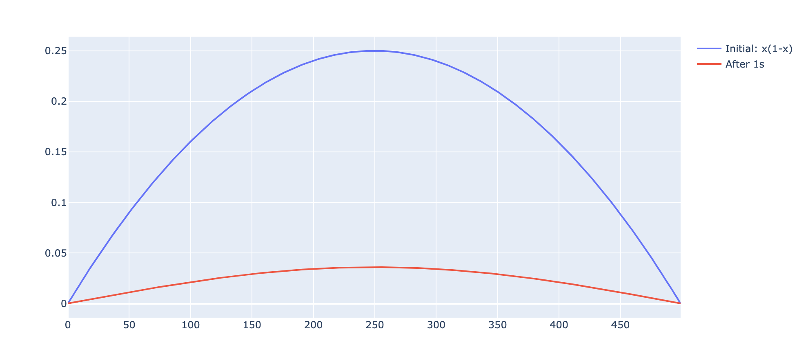

# Tensorflow-Heat-Equation

This repository contains Python Jupyter notebook to solve 1D Heat Diffusion equation using Dirichlet Boundary conditions.

## How to install and execute
Install the requirements using `pip install -r requirements.txt`

Once completed successfully, just open the `.ipynb` notebook in Jupyter.

## Sample Output

## Whom to contact?

Please direct your queries to [gpavanb1](http://github.com/gpavanb1)
for any questions.
